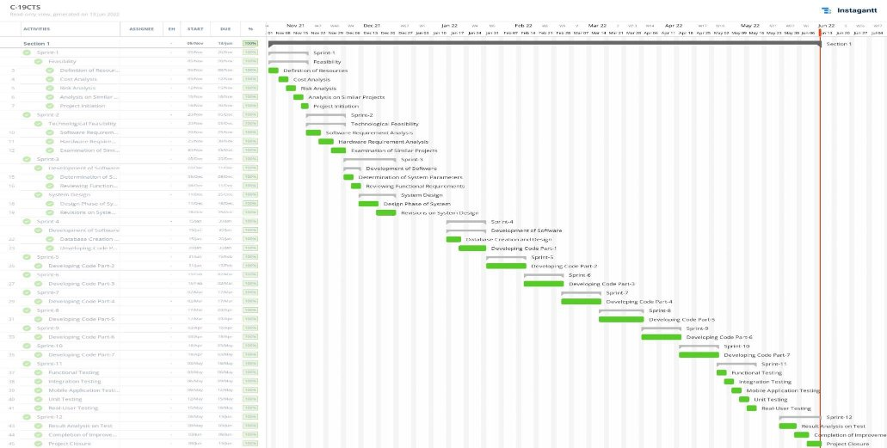

**COVID-19 CONTACT TRACKING SYSTEM** 

You can also check the original technical report from [here](https://www.linkedin.com/feed/update/urn:li:activity:6954407891084668928/).

**ABSTRACT** 

The Covid-19 Contact Tracking System is used for controlling the contacts of the users of the application via valid and verified PCR/Antigen tests that are uploaded to the system. This application is available for the staff and students of the Computer Engineering Department of EMU. Application is verifying the uploaded PCR/Antigen tests to mark the user as Covid-19 positive or negative and it will use Bluetooth as the method for getting the distance between users. Distance between users will affect the current status of the user, if user gets closer than 1.5 meters to a user that is Covid-19 positive or a contacted user, the users’ status will be risky. The mobile application is developed by using Flutter and Firebase. In the end, the project is well-designed, well documented, easily accessible and user friendly. 

**Keywords:** Pandemic, Mobile, Tracking, Contact, Flutter, Firebase 

1. **INTRODUCTION** 

In this project, we developed the COVID-19 CONTACT TRACKING SYSTEM, a fully functional application that monitors the number of people you have contacted during the covid- 19 pandemic and notifies you if you are at risk. During the development of this project, we chose  Agile Development Model from SDLC methodologies because  Agile Development Model is the best option to understand the requirements in small and medium scale software projects like this. Also, this model allows us to scale this project easily. 

The Covid-19 Contact Tracking System keeps the contacts in the database by scanning other devices in the background in real time via the Bluetooth module of the device, and keeps the contacts in the database, and sends a notification to everyone who comes into contact with them in case there is a risky person among them. You can track how many people you are in contact with daily in the application and upload your PCR, Antigen test results. 

The biggest reason why we designed this application is to reduce the spread of the covid- 19 virus by warning people and to ensure the protection of social distance. 

2. **PROJECT PLANNING AND MANAGEMENT**

2. **Aim, Purpose, Target Users** 

**The primary aim** of the Covid-19 Contact Tracking System is to try to keep the students and lecturers at our school safe during the pandemic and to prevent the pandemic from spreading even faster. 

**The target users** of the system are Eastern Mediterranean University students and staff. 

**The purpose** of the Covid-19 Contact Tracking System is to prevent the spread of the pandemic by detecting people at risk of covid through contacts. 

3. **The Reason of Starting this Project** 

**The main reason of starting the Covid-19 Contact Tracking System** is to prevent the spread of the pandemic by detecting people at risk of covid through contacts. With this application, the Bluetooth module in our smartphones, which we all have in our pockets, is prevented to a certain extent from scanning the devices around and exceeding the social distance. We can easily receive warnings if there are risks among the people, we exceed the social distance. 

4. **Output / Success Criteria of the Project** 

At the end of this project, we aim to achieve a fully functional mobile contact tracking system. In this system, you can upload the PCR and Antigen test results, follow the results, and view the number of people you contact daily and real-time. This application is suitable for people who have had a covid-19 PCR or Antigen test. Otherwise, the app won't be able to know your pandemic health status. 

5. **Gantt Chart ***Figure 1 – Gantt Chart* 

7. **List of Milestones ***Table 14 – List of Milestones* 

||**Description of Output** |**Expected Time Interval** |
| :- | - | - |
|1 |Feasibility |05\.11.2021 – 20.11.2021 |
|2 |Technological Feasibility |20\.11.2021 – 05.12.2021 |
|3 |System Design |05\.12.2021 – 25.12.2021 |
|4 |Development of Software |15\.01.2022 – 03.05.2022 |
|5 |Test & Maintenance |03\.05.2022 – 08.06.2022 |
|6 |Project Closure |08\.05.2022 – 13.06.2022 |

8. **Procurement Tables** 

*Table 15 – Procurement Table* 

|Risk |Probability |Effects |Your Strategy |
| - | - | - | - |
|The time required to develop the  software  is underestimated. |High |Serious |Proper working strategy would easily solve this problem. |
|Software tools cannot work together  in  an  integrated way. |High |Tolerable |Finding  other  variants  of  tools  to work together in an integrated way if necessary. |
|Customers fail to understand the  impact  of  requirements changes. |Moderate |Tolerable |Trying  to  convince  customer  with clearing out that a little requirement change  might  have  an  extended deadline impact can solve this issue. |
|The rate of defect repair is underestimated. |Moderate |Tolerable |Replace  potentially  defective components  with  more  reliable bought-in components. |
|The size of  the software is underestimated. |High |Serious |
Investigate buying SW components.  

Investigate  use  of  a  program generator. 
|
|Code  generated  by  code generation  tools  is inefficient. |Moderate |Insignificant |More detailed compiler can be used, or code can be written with another similar language. |
|Key  staff  are  ill  at  critical times in the project. |Moderate |Serious |Reorganize  team  so  that  there  are more  overlap  of  work  and  people therefore  understand  each  other’s jobs. |
|The  database  used  in  the system  cannot  process  as many  transactions  per second as expected. |Moderate |Serious |Investigate the possibility of buying a higher-performance database.  |

9. **Commercialization Potential** 

This system has been developed for the extraordinary situation of the Covid-19 pandemic and has been developed in a completely non-profit manner due to the security of personal data. It cannot be commercialized. 

10. **Project Economic Expectations ***Table 16 – Project Economic Expectations* 

|**2- List your expectations to your team which are come by your project** ||
| - | :- |
|Time-to-market (month): |July |
|The expected increase in sales revenue (%): |%0(Non-Commercial application) |
|The expected increase in market share (%): |%0(Non-Commercial application) |
|Time to start to gain: |- |

|**TASK    ID** |**Task Name** |**Normal Time** |**Crash Time** |**Normal Cost ($)** |
`  `**Crash  Cost** 

**($)** 
|**Max # days of reduction**|**Reduce Cost Per week** |
| - | - | :-: | - | :-: | :-: | :-: | :-: |
|A|Project Initiation |1 day |0\.5 |500$ |600$ |0\.5 |200$ |
|B |Feasibility Research |17 days |10 days |1000$ |1500$ |7 |71\.42$ |
|C |System Design |9 days |5 days |2500$ |3300$ |4 |200$ |
|D |Development Database Design |3 days |1\.5 days |3700$ |4200$ |1\.5 |333\.33$ |
|E |Development coding |10 days |7 days |3600$ |4500$ |3 |300$ |
|F |Modeling and Prototyping |3 days |1 days |3100$ |5000$ |2 |950$ |
|G |Test Study and Maintenance |8 days |6 days |1400$ |2000$ |2 |300$ |
|H |Project Closure |2 days |1 days |300$ |500$ |1 |200$ |

Reduce Cost Per Week= (Crash Cost-Normal Cost) / (Normal Time – Crashing Time) 

13. **PM Tools** 

*Figure 3 – Quality Functional Deployment (QFD)* 

In QFD, quality is a measure of customer satisfaction with a product or a service. QFD is a structured method that uses the seven management and planning tools to identify and prioritize customers’ expectations quickly and effectively. 

*Figure 4 – Kano Model* 

The Kano Model (pronounced “Kah-no”) is an approach to prioritizing features on a product roadmap based on the degree to which they are likely to satisfy customers. Product teams can weigh a high-satisfaction feature against its costs to implement to determine whether adding it to the roadmap is a strategically sound decision. 

3. **REQUIREMENT ANALYSIS** 
1. **Functional Requirements** 
1. *Sign Up* 

REQ1-1: The users should be able to register the system with their name, surname, valid       school mail, valid nationality id no, birth date and gender.  

REQ1-2: Sign up page should contain ‘Register’ button. 

REQ1-3: Sign up page should contain a Terms and Conditions checkbox. 

2. *Sign In*  

REQ2-1: Users should log in the system with their mail address and password. 

REQ2-2: The system should check the mail address from the database, if it is not in database, then login should not be validated. 

REQ2-3: Sign in page must contain e-mail and password field. REQ2-4: Sign in page must contain ‘Login’ button. 

REQ2-5: User must fill all the fields in the Login page. REQ2-6: Sign in page must contain a ‘Forgot Password’ button. 

3. *Landing Page* 

REQ3-1: Landing page must contain a ‘Login’ button. 

REQ3-2: Landing page must contain a ‘Register’ button. 

REQ3-3: Landing page shall contain a ‘Login with Microsoft’ button. REQ3-4: Landing page shall have the logo of the application. 

4. *View and Update Profile*  

REQ4-1: The users shall be able to update and view its profile. 

REQ4-2: The system admin shall be able to view every user’s information. 

5. *Main Page* 

REQ5-1: The users shall be able to view current risk status in main page. 

REQ5-2: The users shall be able to view recent contacts and total number of contacts in main page. 

REQ5-3: The users shall be able to view risk level in main page. REQ5-4: Main page should contain a reminder for masks. 

6. *View/Upload PCR/Antigen Test* 

REQ6-1: The users shall be able to view the latest uploaded PCR/Antigen Test result and its expiry date. 

REQ6-2: PCR/Antigen Upload page must contain ‘Upload’ button. REQ6-3: The users shall be able to upload new PCR/Antigen Test results. REQ6-4: PCR/Antigen Test Results size must not exceed 2mb. 

7. *Close Contacts* 

REQ7-1: Contacts page must contain the contacts that are in close relation with the user. 

REQ7-2: Contacts page must contain a manual ‘add contact’ button. 

8. *Risk Level* 

REQ8-1: Risk level page must contain full name, gender, age, current health status and phone number. 

REQ8-2: Risk Level page should contain the count of contacted persons. 

REQ8-3: Risk Level page should contain a weekly graph for contacted people count at each day in a week. 

9. *Settings* 

REQ9-1: The users shall be able to change their wi-fi, Bluetooth, location services and notifications on or off.  

REQ9-2: Settings page must contain ‘Log Out’ button. 

REQ9-3: Settings page must contain a back button. 

REQ9-4: Settings page should contain a text to inform users for program to work as expected, wi-fi, Bluetooth and location services must remain on. 

2. **Non-Functional Requirements** 
1. *Security*  

The application will keep all user information in Firebase which is a database service that Google Inc. provides. Firebase is a very reliable service that has very low chance of malicious or accidental actions outside of the designed usage of the system. 

- System will be backed up time to time to prevent losing data in case of any system failure. 
- All user information will be held encrypted and secured in a secure path for improved security. 
- All admin features require Firebase Admin SDK to improve reliability. We developed an API to use Firebase Admin SDK to access Firebase Admin features. 
2. *Efficiency*  

The application should not drain battery of the mobile phone. Application will get the distance between two mobile phones via Bluetooth Low Energy Technology so it will be battery efficient. 

3. *Reusability* 

The application will be usable again under any other new pandemic circumstance. When necessary, modifications are done for the new pandemic, it will become useful again. 

4. *Usability* 

The  application  is  providing  opportunity  to  perform  the  desired  operation  safely, efficiently, effectively, and easily while inside context of use. 

5. *Accessibility* 

Anyone that can use a mobile phone will be able to use the application as desired. Since we use Firebase, i.e., Google Cloud Platform, for background services, our accessibility is 24/7 and very fast from all over the world. 

6. *Scalability* 

For the staff and students that are in Computer Engineering Department of EMU, Firebase will be enough. If necessary and desired, with little expenses the application can be scaled up and serve higher amount of people. 

7. *Extensibility* 

The  application  is  well  designed  and  prepared  for  future  extensions  that  may  be implemented, whether these extensions are addition of a new function or modifying an existing one. 

3. **Realistic constraints**  
- Mobile phone is required for using the application. 
- Using the application consumes battery of the phone. 
- The application is designed for the circumstances of the Covid-19 pandemic, after the end of Covid-19 pandemic, application will not be useful. It can be modified to meet the requirements of any other new pandemic that may occur.  
- It is ethically necessary to provide adequate security to prevent any damage to user information. 
- The application is manufactured using completely available and free resources. 
4. **Ethical issues**  

Personal information of every user will be held in the database, providing security, and not sharing them with third parties will be necessary to ensure ethical safety. 

4. **DESIGN** 
1. **High level design (architectural)** 

While  preparing  High  Level  Architectural  Design,  we  decided  to  use  the  Google Firebase service so that the number of resources that may be required for the services of the application is elastic and reliable. In this way, the pricing will be as much as we use, and the services will be active and reliable 24/7. You can see the related Architecture Diagram in Figure 3. As you can see here, Admin requires access to Firebase with Firebase Admin SDK to eliminate Firebase security vulnerability if user can delete, update and add. In this context, we have developed the CCTS (Covid-19 Contact Tracking System) Admin API with Typescript- NodeJS to authorize our requests to the background of the Admin Panel and increase its security. 

*Figure 5 – Architecture Diagram*  

2. **Software design** 

*Figure 6 – Use Case Diagram* 

*Table 21 – Login Use Case* 

|Use Case UC-1: |Login  ||
| - | - | :- |
|Related Requirements: |REQ-1,2 ||
|Initiating Actor: |Admin, User ||
|Actors Goal: |To successfully log in into their account ||
|Participating Actors: |Admin, User ||
|Preconditions: |Email address and password ||
|Post Conditions: |
User: Display the maps

Admin: Display the admin panel 
||
|Main  Success Scenario: |||
|![ref1]|1\. |Users, Admins enter the system Login page on mobile app or Web Browser. |
||2\. |System  shows  the  user  and  admin  a  menu  to  enter  login details. |
||3\. |User enters the password and mail address   |
||4\. |System redirects user to default page after login is successful. For users, display default map page. For admin, view admin panel page. |
|Alternate Scenarios: |||
||1\. |System shows warning massage if entered wrong information or missed the filling parts. |

*Table 22 – Register Use Case* 

|Use Case UC-2: |Register  ||
| - | - | :- |
|Related Requirements: |REQ-2 ||
|Initiating Actor: |User ||
|Actors Goal: |To successfully create new account  ||
|Participating Actors: |Admin, User ||
|Preconditions: |Email address and password ||
|Post Conditions: |User: Display the credit card page** ||
|Main  Success Scenario: |||
|![ref1]|1\. |Users enter the system create account page on mobile app. |
||2\. |System shows the registration page and ask the users details. |
||3\. |User fills the required areas.  |
||4\. |System redirects user to default page after login is successful. System displays PCR/ANTIGEN upload page. |
||5\. |The user selected valid PCR test result document. |
||6\. |System shows successful registration message. |
|Alternate Scenarios: |||
||1\. |System shows warning massage if entered wrong information or missed the filling parts. |

*Table 23 – CRUD Operations* 

|Use Case UC-3: |CRUD Operations  ||
| - | - | :- |
|Related Requirements: |REQ-6,7 ||
|Initiating Actor: |Admin ||
|Actors Goal: |Admins logs into the system and do operations ||
|Participating Actors: |Admin, User ||
|Preconditions: |Email address and password ||
|Post Conditions: |Admins do crud operations on the system ||
|Main  Success Scenario: |||
||1\. |Admins click the edit button. |
||2\. |System displays the users or vehicles details to admin |
||3\. |Admin selects the user or vehicle from the system  |
||4\. |System displays the details about related selection. |
||5\. |Admin select the remove, update, create and display button |
||6\. |The system does the operations according to selections. |
|Alternate Scenarios: |||
||1\. |If the admin is trying to progress without a selection, system will show an error message. |

*Figure 7 – Activity Diagram* 

An activity diagram shows software processes as a progression of actions. When the user opens the application, the system first checks the authentication in the background and sends it directly to the home page if the user is authenticated or redirects it to the SignInSignUp page if the user is not authenticated. An error message will appear on the screen if an invalid credential is entered on the SignIn or Register pages. When the home page is reached without error, the user can go to the PCR / ANTIGEN page and upload the test result. During this download, if the file does not have a .pdf extension or is larger than 2MB, an error message will be displayed, and you will be directed to the file upload page. If the file is in suitable conditions, it is converted to JPEG format and it is checked for QR or DATA\_MATRIX code using Machine Learning. If any  of  these  two  codes  exist,  the  code  is  converted  to  the  URL  and  the  HTML  data corresponding to the URL is scraped with the appropriate libraries and it is checked whether the data on the site match with the user. If it matches, whether the PCR/Antigen test is within 72 hours is checked from the data pulled from the site, and if appropriate, the user's healthStatus is automatically updated. 

*Figure 8 – E-R Diagram* 

The Entity Relationship diagram above shows the model classes we use in our system and their relationships. Each entity in the diagram can be thought of as an object with a property or attribute in the system. For example, the users and contacts entities. Users have id, name, surname, phone, Email, sex, birthDate, signUpDate,* ucid, healthStatus and email. Contacts have features that keep singleContactID, UUID’s (UNIQUE USER IDENTIFIER) of two people making contact, UCID's (UNIQUE CONTACT IDENTIFIER) of two people's, latitude, longitude and date of that the contact took place. These attributes provide information about all these objects. In terms of system functionality, if two users get close without observing social distance, the UCID's and UUID’s of both users are kept in the database together with the date, latitude and longitude of the contact as a contacts object. For this reason, there is a relationship between users and contacts.* 

*Figure 9 – User Sequence Diagram* 

As seen in the diagram above, assuming the user has an account, there will be some entries in the system that we need to log into. These can be e-mail and password entries. The information that entered by the user will be checked. If user entered valid information that identify their existing account, they will be successfully entered. Otherwise, verification will be unsuccessful and there will be error message on the screen. System checks user information with the database records. Also, if we assume that there is not any account of the user, they must sign up first. There will be signup form on the system they will sign. The system will send a request to database for signing then sign-up page will be displayed on the screen. After those users will enter their personal information’s. Then validity control will be made on entered information’s, if they are valid the sign up will be successfully completed but if not, sign up will be unsuccessful and display unsuccessful message to the user. 

*Figure 10 – Admin Sequence Diagram* 

As seen in the diagram above, assuming the admin has an account, there will be some entries in the system that we need to log into. These can be e-mail and password entries. The information that entered by the admin will be checked. If Admin entered valid information that identify their existing account, they will be successfully entered. Otherwise, verification will be unsuccessful and there will be error message on the screen. After the admin has successfully logged in, the user reaches the screen where he can delete and add again. Admin can delete the relevant user by querying the system with the id number of the user he/she wants to delete. 

5. **IMPLEMENTATION** 
1. **Tools, technologies and platforms used** 

Since the app must be developed on mobile, the app has been developed using the very advanced Flutter UI Toolkit that allows us to get native builds for both iOS and Android. During the development, we used the flutter\_beacon library to continuously broadcast and scan around the BLE (Bluetooth Low Energy™) technology of the Bluetooth module by consuming low power. We developed the server side using secure, 24/7 active and scalable Google Firebase. We needed the firebase\_core and firebase\_auth libraries in Flutter to be able to access this cloud service.  In  this  way,  we  provided  direct  access  to  the  affordable  and  high-performance Authentication API offered by Google without using an additional API. Since Google keeps the security of admin processes at a very high level, it is necessary to access a REST API using the  Firebase  Admin  SDK  so  that  we  can  perform  CRUD  operations  on  the  Firebase Authentication API. For this, a CCTS Admin API was developed using the Firebase Admin SDK using the Express framework with NodeJS-Typescript.  

We used the Android emulator with Visual Studio Code and Android Studio AVD Manager during development. Figma and Adobe Photoshop were used for the designs. 

2. **Algorithms** 

*PCR/Antigen Detection Algorithm* 

File picked\_file; 

UserDatabaseService userDatabaseService; 

if picked\_file.extension is PDF 

then 

if picked\_file.size < 2 MB 

then  

jpeg\_file = pdfToJpeg(picked\_file) 

url = ML(jpeg\_file, ScanSettings(QR, DATA\_MATRIX)) 

html = fetch(url) 

if userDatabaseService.user.name == html.div…..  

then 

if DateTime.fromString(html.div……..) > DateTime.now()-

Duration(days:3) 

then 

if html.div……………toUpperCase() == ‘NEGATIVE’ 

then 

userDatabaseService.updateUser(healthStatus: ‘riskless’) else 

userDatabaseService.updateUser(healthStatus: 

‘infected’) else 

forward upload page with error else 

forward upload page with error 

3. **Standards** 

The standards we used in this project are as follows: 

- Software Requirements Specification Document: IEEE 830-1998 
- Implementation: Google Development  
4. **Detailed description of the implementation (coding)** 

Since the mobile application is planned to be developed for Android and iOS, it was decided to develop it using the Flutter Mobile Development UI Kit. In line with this decision, the development of the application was built with the development of Authentication systems as the first stage. 

*Authentication* 

While  developing  the  Authentication  system,  the  Authentication  API  provided  by Firebase is used, but this Authentication API has disadvantages as well as advantages. The most important  factor  that  can  be  mentioned  as  an  advantage  is  that  it  fully  supports  OAuth technology and the SMS Auth we have used in our system. The disadvantage is that adding and removing user data is very complicated and limited. Based on this, we can open a record of the user with the same UUID directly to the Firebase Firestore Database and play all the games we want in it, if the user can register without error during registration. Afterwards, we added a Phone Number Verification system to prevent users from opening more than one account and to increase user accuracy. This system uses Firebase Phone Auth in the background, but not for login. We tricked Google into using SMS verification not to log into the app, but to verify the phone number of a user who is already logged into the app. Since the data is checked in real- time as a background, we also made it mandatory and automatic to direct the user to the relevant page to add that data in case of any missing data in the database, so that we prevent use in such a critical application when user accuracy is lacking. 

*Main Functions* 

During the main screen front end development process, we kept the interface as simple as possible in order to ensure that the technical infrastructure of our application is high, but that all users can use it easily. When the application is first opened, it is directed to the landing page, sign in Sign Up Page, and the buttons that the user can be directed to Login or Register pages are faced with. After completing the process on the relevant screen, if authenticate is enabled, the user is directed to the main page and the Bluetooth, Background Service and Location Service permissions are requested from the user. If the user approves, the application uses the user data in the background to run the BLE iBeacon Broadcast and Scan systems, check if there is another user around, and at the same time broadcast the UCID we have determined around the device so that it can be detected by other devices. If the device encounters another device around, it directly asks the database whether the device it encountered is in our systems, then if the encountered device is located in our systems, it asks if it has encountered before during the day and if it is not encountered, the contact is created in the database and the counter on the application main screen works in real time. The number added to the database also affects the counter and the number of contacts is increased by 1. Every day at 12:00PM in the evening, the daily chart is transferred to the chart on the RiskLevel screen, and the daily chart is reset. 

6. **TESTING** 

*Table 24 – Test Case 1* 

|**Test Case ID:** |TC-1 |
| - | - |
|**Test Case Name:** |User Login |
|**Pass/Fail Criteria:** |
Pass:  User  enters  correct  mail  and  password  -> Successfully Login 

Fail: User enters wrong mail and password -> Display Error Message 
|
|**Input Data:** |User mail, Password |
|**Test Procedure:** |Expected Output: |
|**Step 1: Enter correct information’s** |Sign into system successfully |
|**Step 2: Enter wrong information’s** |System  displays  the  “Invalid  Password  or  Mail Address” message |
|**Comments:** |Test passes successfully |

*Table 25 – Test Case 2* 

|**Test Case ID:** |TC-2 |
| - | - |
|**Test Case Name:** |User Register |
|**Pass/Fail Criteria:** |
Pass: Users fill all required field on the registration form> Successfully Register 

Fail: User miss the enters information’s -> Display Error Message 
|
|**Input Data:** |Name, surname, mail address, password |
|**Test Procedure:** |Expected Output: |
|**Step 1: Register** |Register the system successfully. |
|**Step 2: missing information’s** |System displays the error message |
|**Comments:** |Test passes successfully |

*Table 28 – Test Case 3* 

|**Test Case ID:** |TC-3 |
| - | - |
|**Test Case Name:** |Upload PCR/Antigen Test Result Document  |
|**Pass/Fail Criteria:** |
Pass: User select appropriate test result file and press upload button> Successfully Uploaded 

Fail: User select invalid file and press upload button 

> Display Error Message 
|
|**Input Data:** |PDF file that is smaller than 2MB |
|**Test Procedure:** |Expected Output: |
|**Step 1: Upload new test result** |File successfully uploaded. |
|**Step 2: JPEG file** |System displays the error message |
|**Comments:** |Test passes successfully |

7. **USER GUIDE OF THE SYSTEM** 

*Figure 11 – Welcoming Screen (SignIn, SignUp)* 

The screen that the user will encounter when first opening the application is Figure X. From here, the user can be directed to the Login page if he has an account, or to the Register page if he does not have an account. 

*Figure 12 – Login Screen* 

If there is a user account on the login page, they can log in. 

*Figure 13 – Register Screen* 

On the Register page, if the user does not have a registered account in the system, they can register with their personal information. 

*Figure 14 – PCR / ANTIGEN Screen* 

After the user has successfully logged into the system, the system learns the health status of the user by prompting user to load a valid PCR or ANTIGEN test result. 

*Figure 15 – Home Page Screen* 

After uploading the current test result, the user is directed to the home page. On the homepage, there is a summary of how many people you have contacted for 24 hours. At the same time, there is a button where you can go to the Risk Level page where you can learn your risk level in detail, a button where you can upload a more recent PCR / ANTIGEN test result, and a button where you can go to the Contacts page where you can add people you spend a lot of time within your daily life. 

*Figure 16 – Risk Level Screen* 

A summary of your health status along with a summary of your personal information on the Risk Level page, a colored indicator showing how many people you have been in contact with in 24 hours, and a contact graph that you can view on a daily, weekly and monthly basis. 

*Figure 17 – Reset Password Screen* 

On this screen, if your e-mail address is registered in the system, you can send a password reset e-mail request. 

*Figure 18 – Settings Screen* 

On the settings page, there are buttons where you can  turn on and off application notifications, location, Bluetooth and wi-fi services, as well as log out of your account in the application. 

*Figure 19 – Register Phone Number Screen* 

This page allows us to verify the phone number so that we can easily verify the user during registration. It is the page where we create OTP request using Google services. 

*Figure 20 – OTP Verification Screen* 

On this page, there is a component where we will enter the incoming single-use SMS code. This component also has the feature of automatically fetching and confirming the incoming SMS code on both iOS and Android platforms. If a problem occurs and no SMS is received, when the 60-second countdown ends, the Re-send SMS button will appear, and we can easily send an SMS request again. 

*Figure 21 – Reset Password Email* 

This password reset e-mail is the e-mail that is automatically created and sent to the user when users request a password reset e-mail in our system. In case of any problem here, the contact addresses, system's Privacy Policy and password reset link are in the middle part. 

*Figure 22 – OTP SMS Example* 

An example OTP SMS code. 

*Figure 23 – Privacy Policy Screen* 

This screen contains the detailed text of the privacy policy that you must confirm before registering. 

*Figure 24 – Terms and Conditions Screen* 

On this screen, there is the full text of the Terms and Conditions, which must be approved while registering. 

*Figure 25 – Background Service Notifications* 

In case the beacon service starts in the background and the contact's contacts are started to be tracked, a notification of the background service appears in the notification bar and informs the user that the service is running. 

*Figure 26 – Contact Tracking - Admin Panel Dashboard* 

This is the dashboard landing screen of the admin panel of project. Admin can follow the monthly signed up user count and monthly contact counts as a statistic. Also, admin can see the latest contact details table on the middle of the screen. In this table, admin can move to the contacted users’ detail by clicking the user id. Also, admin can check the contact approximate location via clicking the location coordinates. This link forwards admin to Google Maps API. 

*Figure 27 – Contact Tracking - Admin Panel User Details* 

In  this  screen  admin  can  see  the  contact  detail  of  the  certain  user  and  detailed information of that user. Also, right side of the screen there is daily contact chart that shows the daily contact of that user. 

*Figure 28 – Contact Tracking - Admin Panel Users List* 

Admin can see all users and forward their certain user profile page via clicking the view button on the Action column of the table. Also, by clicking the Delete, admin may delete user from database and Firebase Authentication API both. 

8. DISCUSSION 

Thanks to this application, reaching the medical risk information of each staff and student  at  the  department  of  computer  engineering  related  to  Covid-19  will  get  easier. Application will automatically change the current state to ‘risky’ from ‘riskless’ if there are any Covid-19 positive cases which the user has been contacted in the last few days. This will help the department staff to take quick action if necessary. While it may not seem like a real savings for staff and students, it is. If a user is in ‘risky’ state, the application and pandemic reasons will prompt the user to have a PCR/Antigen test and if the result is positive, the user will be quarantined. This process is important on a broader perspective because when a person is positive without knowing it, the risk of infecting other people is much higher than in quarantine, and if that is the case, more and more people will have to do PCR/Antigen testing. Since PCR/Antigen tests are paid, the total amount spent on these tests will gradually increase. On the other hand, the fight against pandemic will be easier in this way. 

9. **CONCLUSION** 

This project is meant for fighting against pandemic. The application requires a valid PCR/Antigen test to assign a current health state to the user, ‘Riskless’ or ‘Risky’. In general, this project can lead a decrease to the total amount of money spent on PCR/Antigen tests and letting people know that they were contacted with other Covid-19 positive cases which is helping them to get action quicker. Throughout the project, we have learned various project management methods and we have learned and improved ourselves in Flutter, Figma and Firebase. In general, we got better in practice. 

10. **REFERENCES** 
1. Smart Sensor Devices, Distance Measuring Solution for COVID-19 using Bluetooth Low Energy, Oct. 2020. Accessed on: Jan. 17, 2022. [Online]. Available: [https://smartsensordevices.com/distance-measuring-solution-for-covid-19-using-bluetooth- low-energy/ ](https://smartsensordevices.com/distance-measuring-solution-for-covid-19-using-bluetooth-low-energy/)
1. Firebase, Firebase Authentication, Accessed on: Jan. 4, 2022. [Online] Available:  [https://firebase.google.com/docs/auth ](https://firebase.google.com/docs/auth)
1. Bluetooth Tech World, Can Bluetooth Be Used To Measure Distance?, Jun. 2020. Accessed on: Jan. 17, 2022. [Online]. Available:[ https://bluetoothtechworld.com/can- bluetooth-measure- distance/#:~:text=Bluetooth%20devices%20are%20not%20usually,The%20popular%20appro ach%20is%20triangulation.](https://bluetoothtechworld.com/can-bluetooth-measure-distance/#:~:text=Bluetooth%20devices%20are%20not%20usually,The%20popular%20approach%20is%20triangulation) 
1. Accurate & Secure Distance Measurement with Bluetooth, IMEC, Accessed on: Jan. 20, 2022 [Online]. Available:[ https://www.imec-int.com/drupal/sites/default/files/2018- 11/Accurate%20and%20secure%20Distance%20Measurement%20with%20Bluetooth.pdf ](https://www.imec-int.com/drupal/sites/default/files/2018-11/Accurate%20and%20secure%20Distance%20Measurement%20with%20Bluetooth.pdf)
1. P. Dehaye, Inferring distance from Bluetooth signal strength: a deep dive, Medium, May. 2020. Accessed on: Jan. 15, 2022. [Online]. Available:[ https://medium.com/personaldata- io/inferring-distance-from-bluetooth-signal-strength-a-deep-dive-fe7badc2bb6d ](https://medium.com/personaldata-io/inferring-distance-from-bluetooth-signal-strength-a-deep-dive-fe7badc2bb6d)
1. R. Palankar, Flutter File\_Picker Package, Pick image, video, doc FilePicker Example, Proto Coders Point, October. 2021. Accessed on: Mar. 23, 2022. [Online]. Available: [https://protocoderspoint.com/flutter-file_picker-package-pick-image-video-doc-file-picker- example/ ](https://protocoderspoint.com/flutter-file_picker-package-pick-image-video-doc-file-picker-example/)
1. H. Sharma, Securing local storage in Flutter, Log Rocket, Feb. 2022. Accessed on: Apr. 10, 2022. [Online]. Available:[ https://blog.logrocket.com/securing-local-storage-flutter/ ](https://blog.logrocket.com/securing-local-storage-flutter/)
1. L. Lin, Flutter & Firebase App Tutorial — Part 5 Stream & Provider in Flutter, Medium, Oct. 2021. Accessed on: Apr. 11, 2022. [Online]. Available: [https://medium.com/@lumeilin301/flutter-firebase-app-tutorial-part-5-stream-in-flutter- 82c0c14adbe9 ](https://medium.com/@lumeilin301/flutter-firebase-app-tutorial-part-5-stream-in-flutter-82c0c14adbe9)

**APPENDIX** 

*Terms and Conditions* 

Covid-19 Contact Tracking System is licensed to You (End-User) by Eastern Mediterranean University, located and registered at Eastern Mediterranean University, Famagusta, Mersin 10 99628, Turkey ("Licensor"), for use only under the terms of this License Agreement. 

By downloading the Licensed Application from Apple's software distribution platform ("App Store") and Google's software distribution platform ("Play Store"), and any update thereto (as permitted by this License Agreement), You indicate that You agree to be bound by all of the terms and conditions of this License Agreement, and that You accept this License Agreement. App Store and Play Store are referred to in this License Agreement as “Services.” 

The parties of this License Agreement acknowledge that the Services are not a Party to this License Agreement and are not bound by any provisions or obligations about the Licensed Application,  such  as  warranty,  liability,  maintenance,  and  support  thereof.  Eastern Mediterranean University, not the Services, is solely responsible for the Licensed Application and the content thereof. 

This License Agreement may not provide for usage rules for the Licensed Application that are in conflict with the latest Apple Media Services Terms and Conditions and Google Play Terms of Service ("Usage Rules"). Eastern Mediterranean University acknowledges that it had the opportunity to review the Usage Rules and this License Agreement is not conflicting with them. 

Covid-19 Contact Tracking System when purchased or downloaded through the Services, is licensed to You for use only under the terms of this License Agreement. The Licensor reserves all rights not expressly granted to You. Covid-19 Contact Tracking System is to be used on devices  that  operate  with  Apple's  operating  systems  ("iOS"  and  "Mac  OS")  or  Google's operating system ("Android"). 

1. **THE APPLICATION** 

Covid-19 Contact Tracking System ("Licensed Application") is a piece of software created to the purpose of the Covid-19 Contact Tracking System is to prevent the spread of the pandemic by detecting people at risk of covid through contacts. — and customized for iOS and Android mobile devices ("Devices"). It is used to The Covid-19 Contact Tracking System is used for controlling the contacts of the users of the application via valid and verified PCR/Antigen tests that are uploaded to the system. 

2. **SCOPE OF LICENSE** 
1. You are given a non-transferable, non-exclusive, non-sublicensable license to install and use the Licensed Application on any Devices that You (End-User) own or control and as permitted by the Usage Rules, with the exception that such Licensed Application may be accessed and used by other accounts associated with You (End-User, The Purchaser) via Family Sharing or volume purchasing. 
1. This license will also govern any updates of the Licensed Application provided by Licensor that replace, repair, and/or supplement the first Licensed Application, unless a separate license is provided for such update, in which case the terms of that new license will govern. 
1. You may not share or make the Licensed Application available to third parties (unless to the degree allowed by the Usage Rules, and with Eastern Mediterranean University's prior written consent), sell, rent, lend, lease or otherwise redistribute the Licensed Application. 
1. You  may  not  reverse  engineer,  translate,  disassemble,  integrate,  decompile,  remove, modify, combine, create derivative works or updates of, adapt, or attempt to derive the source code of the Licensed Application, or any part thereof (except with Eastern Mediterranean University's prior written consent). 
1. You may not copy (excluding when expressly authorized by this license and the Usage Rules) or alter the Licensed Application or portions thereof. You may create and store copies only on devices that You own or control for backup keeping under the terms of this license, the Usage Rules, and any other terms and conditions that apply to the device or software used. 

You may not remove any intellectual property notices. You acknowledge that no unauthorized third parties may gain access to these copies at any time. If you sell your Devices to a third party, you must remove the Licensed Application from the Devices before doing so. 

6. Violations of the obligations mentioned above, as well as the attempt of such infringement, may be subject to prosecution and damages. 
6. Licensor reserves the right to modify the terms and conditions of licensing. 
6. Nothing in this license should be interpreted to restrict third-party terms. When using the Licensed Application, You must ensure that You comply with applicable third-party terms and conditions. 
3. **TECHNICAL REQUIREMENTS** 
1. The Licensed Application requires a firmware version Android 9.0 or higher. Licensor recommends using the latest version of the firmware. 
1. Licensor attempts to keep  the Licensed Application updated so  that it  complies with modified/new versions of the firmware and new hardware. You are not granted rights to claim such an update. 
1. You acknowledge that it is Your responsibility to confirm and determine that the app end- user  device  on  which  You  intend  to  use  the  Licensed  Application  satisfies  the  technical specifications mentioned above. 
1. Licensor reserves the right to modify the technical specifications as it sees appropriate at any time. 
4. **MAINTENANCE AND SUPPORT** 
1. The Licensor is solely responsible for providing any maintenance and support services for this Licensed Application. You can reach the Licensor at the email address listed in the App Store or Play Store Overview for this Licensed Application. 
1. Eastern Mediterranean University and the End-User acknowledge that the Services have no obligation whatsoever to furnish any maintenance and support services with respect to the Licensed Application. 
5. **USE OF DATA** 

You acknowledge that Licensor will be able to access and adjust Your downloaded Licensed Application content and Your personal information, and that Licensor's use of such material and information is subject to Your legal agreements with Licensor 

and Licensor's privacy policy: https://www.freeprivacypolicy.com/live/6b8949d2-642f-408a- 82fa-e55357c5eb41. 

You acknowledge that the Licensor may periodically collect and use technical data and related information about your device, system, and application software, and peripherals, offer product support, facilitate the software updates, and for purposes of providing other services to you (if any) related to the Licensed Application. Licensor may also use this information to improve its products or to provide services or technologies to you, if it is in a form that does not personally identify you. 

6. **USER-GENERATED CONTRIBUTIONS** 

The Licensed Application may invite you to chat, contribute to, or participate in blogs, message boards, online forums, and other functionality, and may provide you with the opportunity to create, submit, post, display, transmit, perform, publish, distribute, or broadcast content and materials to us or in the Licensed Application, including but not limited to text, writings, video, audio, photographs, graphics, comments, suggestions, or personal information or other material (collectively, "Contributions"). 

Contributions may be viewable by other users of the Licensed Application and through third- party websites or applications. As such, any Contributions you transmit may be treated as non- confidential and non-proprietary. When you create or make available any Contributions, you thereby represent and warrant that: 

1\. The creation, distribution, transmission, public display, or performance, and the accessing, downloading, or copying of your Contributions do not and will not infringe the proprietary rights, including but not limited to the copyright, patent, trademark, trade secret, or moral rights of any third party. 

2\.You are the creator and owner of or have the necessary licenses, rights, consents, releases, and permissions to use and to authorize us, the Licensed Application, and other users of the Licensed Application to use your Contributions in any manner contemplated by the Licensed Application and this License Agreement. 

3\.You have the written consent, release,  and/or permission of each and every identifiable individual person in your Contributions to use the name or likeness or each and every such identifiable individual person to enable inclusion and use of your Contributions in any manner contemplated by the Licensed Application and this License Agreement. 

4\.Your Contributions are not false, inaccurate, or misleading. 

5\.Your Contributions are not unsolicited or unauthorized advertising, promotional materials, pyramid schemes, chain letters, spam, mass mailings, or other forms of solicitation. 

6\.Your Contributions are not obscene, lewd, lascivious, filthy, violent, harassing, libelous, slanderous, or otherwise objectionable (as determined by us). 

7\.Your Contributions do not ridicule, mock, disparage, intimidate, or abuse anyone. 

8\.Your Contributions are not used to harass or threaten (in the legal sense of those terms) any other person and to promote violence against a specific person or class of people. 

9\.Your Contributions do not violate any applicable law, regulation, or rule. 

10\.Your Contributions do not violate the privacy or publicity rights of any third party. 

11\.Your Contributions do not violate any applicable law concerning child pornography, or otherwise intended to protect the health or well-being of minors. 

12\.Your Contributions do not include any offensive comments that are connected to race, national origin, gender, sexual preference, or physical handicap. 

13\.Your Contributions do not otherwise violate, or link to material that violates, any provision of this License Agreement, or any applicable law or regulation. 

Any  use  of  the  Licensed  Application  in  violation  of  the  foregoing  violates  this  License Agreement and may result in, among other things, termination or suspension of your rights to use the Licensed Application. 

7. **CONTRIBUTION LICENSE** 

By posting your Contributions to any part of the Licensed Application or making Contributions accessible to the Licensed Application by linking your account from the Licensed Application to any of your social networking accounts, you automatically grant, and you represent and warrant that you have the right to grant, to us an unrestricted, unlimited, irrevocable, perpetual, non- 

exclusive, transferable, royalty-free, fully-paid, worldwide right, and license to host, use copy, reproduce, disclose, sell, resell, publish, broad cast, retitle, archive, store, cache, publicly display,  reformat,  translate,  transmit,  excerpt  (in  whole  or  in  part),  and  distribute  such Contributions  (including,  without  limitation,  your  image  and  voice)  for  any  purpose, commercial advertising, or otherwise, and to prepare derivative works of, or incorporate in other works, such as Contributions, and grant and authorize sublicenses of the foregoing. The use and distribution may occur in any media formats and through any media channels. 

This license will apply to any form, media, or technology now known or hereafter developed, and includes our use of your name, company name, and franchise name, as applicable, and any of the trademarks, service marks, trade names, logos, and personal and commercial images you provide. You waive all moral rights in your Contributions, and you warrant that moral rights have not otherwise been asserted in your Contributions. 

We do not assert any ownership over your Contributions. You retain full ownership of all of your Contributions and any intellectual property rights, or other proprietary rights associated with your Contributions. We are not liable for any statements or representations in your Contributions  provided  by  you  in  any  area  in  the  Licensed  Application.  You  are  solely responsible for your Contributions to the Licensed Application, and you expressly agree to exonerate us from any and all responsibility and to refrain from any legal action against us regarding your Contributions. 

We have the right, in our sole and absolute discretion, (1) to edit, redact, or otherwise change any Contributions; (2) to recategorize any Contributions to place them in more appropriate locations in the Licensed Application; and (3) to prescreen or delete any Contributions at any time and for any reason, without notice. We have no obligation to monitor your Contributions. 

8. **LIABILITY** 
1. Licensor’s responsibility in the case of violation of obligations and tort shall be limited to intent and gross negligence. Only in case of a breach of essential contractual duties (cardinal obligations), Licensor shall also be liable in case of slight negligence. 

In any case, liability shall be limited to the foreseeable, contractually typical damages. The limitation mentioned above does not apply to injuries to life, limb, or health. 

2. Licensor takes no accountability or responsibility for any damages caused due to a breach of duties according to Section 2 of this License Agreement. To avoid data loss, you are required to make use of backup functions of the Licensed Application to the extent allowed by applicable third-party  terms  and  conditions  of  use.  You  are  aware  that  in  case  of  alterations  or manipulations  of  the  Licensed  Application,  you  will  not  have  access  to  the  Licensed Application. 
9. **WARRANTY** 
1. Licensor warrants that the Licensed Application is free of spyware, trojan horses, viruses, or any other malware at the time of Your download. Licensor warrants that  the Licensed Application works as described in the user documentation. 
1. No warranty is provided for the Licensed Application that is not executable on the device, that has been unauthorizedly modified, handled  inappropriately or  culpably, combined or installed  with  inappropriate  hardware  or  software,  used  with  inappropriate  accessories, regardless of if by Yourself or by third parties, or if there are any other reasons outside of Eastern Mediterranean University's sphere of influence that affect the executability of the Licensed Application. 
1. You are required to inspect the Licensed Application immediately after installing it and notify  Eastern  Mediterranean  University  about  issues  discovered  without  delay  by  email provided in Product Claims. The defect report will be taken into consideration and further investigated if it has been emailed within a period of seven (7) days after discovery. 
1. If we confirm that the Licensed Application is defective, Eastern Mediterranean University reserves a choice to remedy the situation either by means of solving the defect or substitute delivery. 
1. In the event of any failure of the Licensed Application to conform to any applicable warranty, You may notify the Services Store Operator, and Your Licensed Application purchase price will be refunded to You. To the maximum extent permitted by applicable law, the Services Store Operator will have no other warranty obligation whatsoever with respect to the Licensed Application, and any other losses, claims, damages, liabilities, expenses, and costs attributable to any negligence to adhere to any warranty. 
1. If the user is an entrepreneur, any claim based on faults expires after a statutory period of limitation amounting to (12) months after the Licensed Application was made available to the user. The statutory periods of limitation given by law apply for users who are consumers. 
10. **PRODUCT CLAIMS** 

Eastern Mediterranean University and the End-User acknowledge that Eastern Mediterranean University, and not the Services, is responsible for addressing any claims of the End-User or any third party relating to the Licensed Application or the End-User’s possession and/or use of that Licensed Application, including, but not limited to: 

1) product liability claims. 
1) any  claim  that  the  Licensed  Application  fails  to  conform  to  any  applicable  legal  or regulatory requirement; and 
1) claims arising under consumer protection, privacy, or similar legislation, including in connection with Your Licensed Application’s use of the HealthKit and HomeKit. 
11. **LEGAL COMPLIANCE** 

You represent and warrant that You are not located in a country that is subject to a US Government embargo, or that has been designated by the US Government as a "terrorist supporting" country; and that You are not listed on any US Government list of prohibited or restricted parties. 

12. **CONTACT INFORMATION** 

For general inquiries, complaints, questions, or claims concerning the Licensed Application, please contact: 

Ali Kumbul 

Eastern Mediterranean University Famagusta, Mersin 10 99628 Turkey 

18000053@emu.edu.tr 

13. **TERMINATION** 

The license is valid until terminated by Eastern Mediterranean University or by You. Your rights  under  this  license  will  terminate  automatically  and  without  notice  from  Eastern Mediterranean University if You fail to adhere to any term(s) of this license. Upon License termination, you shall stop all use of the Licensed Application, and destroy all copies, full or partial, of the Licensed Application. 

14. **THIRD-PARTY TERMS OF AGREEMENTS AND BENEFICIARY** 

Eastern  Mediterranean  University  represents  and  warrants  that  Eastern  Mediterranean University will comply with applicable third-party terms of agreement when using Licensed Application. 

In Accordance with Section 9 of the "Instructions for Minimum Terms of Developer's End- User License Agreement," both Apple and Google and their subsidiaries shall be third-party beneficiaries of this End User License Agreement and — upon Your acceptance of the terms and conditions of this License Agreement, both Apple and Google will have the right (and will be deemed to have accepted the right) to enforce this End User License Agreement against You as a third- party beneficiary thereof. 

15. **INTELLECTUAL PROPERTY RIGHTS** 

Eastern Mediterranean University and the End-User acknowledge that, in the event of any third- party claim that the Licensed Application or the End-User's possession and use of that Licensed Application infringes on the third party's intellectual property rights, Eastern Mediterranean University, and not the Services, will be solely responsible for the investigation, defense, settlement, and discharge or any such intellectual property infringement claims. 

16. **APPLICABLE LAW** 

This License Agreement is governed by the laws of Turkey excluding its conflicts of law rules. 

17. **MISCELLANEOUS** 
1. If any of the terms of this agreement should be or become invalid, the validity of the remaining  provisions  shall  not  be  affected.  Invalid  terms  will  be  replaced  by  valid  ones formulated in a way that will achieve the primary purpose. 
1. Collateral agreements, changes and amendments are only valid if laid down in writing. The preceding clause can only be waived in writing. 

*Privacy Policy* 

**Privacy Policy** 

Last updated: March 21, 2022 

This Privacy Policy describes Our policies and procedures on the collection, use and disclosure of Your information when You use the Service and tells You about Your privacy rights and how the law protects You. 

We use Your Personal data to provide and improve the Service. By using the Service, You agree to the collection and use of information in accordance with this Privacy Policy. This Privacy Policy has been created with the help of the Privacy Policy Template. 

**Interpretation and Definitions** *Interpretation* 

The words of which the initial letter is capitalized have meanings defined under the following conditions. The following definitions shall have the same meaning regardless of whether they appear in singular or in plural. 

*Definitions* 

For the purposes of this Privacy Policy: 

**Account** means a unique account created for You to access our Service or parts of our Service. 

**Affiliate** means an entity that controls, is controlled by or is under common control with a party, where "control" means ownership of 50% or more of the shares, equity interest or other securities entitled to vote for election of directors or other managing authority. 

**Application** means the software program provided by the Company downloaded by You on any electronic device, named Covid-19 Contact Tracking System 

**Company** (referred to as either "the Company", "We", "Us" or "Our" in this Agreement) refers to Covid-19 Contact Tracking System. 

**Country** refers to: Turkey 

**Device** means any device that can access the Service such as a computer, a cellphone or a digital tablet. 

**Personal Data** is any information that relates to an identified or identifiable individual. **Service** refers to the Application. 

**Service Provider** means any natural or legal person who processes the data on behalf of the Company. It refers to third-party companies or individuals employed by the Company to facilitate the Service, to provide the Service on behalf of the Company, to perform services related to the Service or to assist the Company in analyzing how the Service is used. 

**Usage Data** refers to data collected automatically, either generated by the use of the Service or from the Service infrastructure itself (for example, the duration of a page visit). 

**You** mean the individual accessing or using the Service, or the company, or other legal entity on behalf of which such individual is accessing or using the Service, as applicable. 

**Collecting and Using Your Personal Data** *Types of Data Collected* 

***Personal Data*** 

While using Our Service, we may ask You to provide Us with certain personally identifiable information that can be used to contact or identify You. Personally identifiable information may include, but is not limited to: 

Email address 

First name and last name Phone number 

Usage Data 

***Usage Data*** 

Usage Data is collected automatically when using the Service. 

Usage Data may include information such as Your Device's Internet Protocol address (e.g. IP address), browser type, browser version, the pages of our Service that You visit, the time and date of Your visit, the time spent on those pages, unique device identifiers and other diagnostic data. 

When  You  access  the  Service  by  or  through  a  mobile  device,  We  may  collect  certain information automatically, including, but not limited to, the type of mobile device You use, Your mobile device unique ID, the IP address of Your mobile device, Your mobile operating system, the type of mobile Internet browser You use, unique device identifiers and other diagnostic data. 

We may also collect information that Your browser sends whenever You visit our Service or when You access the Service by or through a mobile device. 

***Information Collected while Using the Application*** 

While using Our Application, in order to provide features of Our Application, We may collect, with Your prior permission: 

\- Information regarding your location 

We use this information to provide features of Our Service, to improve and customize Our Service. The information may be uploaded to the Company's servers and/or a Service Provider's server or it may be simply stored on Your device. 

You can enable or disable access to this information at any time, through Your Device settings. 

***Use of Your Personal Data*** 

The Company may use Personal Data for the following purposes: 

**To provide and maintain our Service**, including to monitor the usage of our Service. 

**To manage Your Account**: to manage Your registration as a user of the Service. The Personal Data You provide can give You access to different functionalities of the Service that are available to You as a registered user. 

**For the performance of a contract:** the development, compliance and undertaking of the purchase contract for the products, items or services You have purchased or of any other contract with Us through the Service. 

**To contact You:** To contact You by email, telephone calls, SMS, or other equivalent forms of electronic communication, such as a mobile application's push notifications regarding updates or informative communications related to the functionalities, products or contracted services, including the security updates, when necessary or reasonable for their implementation. 

**To provide You** with news, special offers and general information about other goods, services and events which we offer that are similar to those that you have already purchased or enquired about unless You have opted not to receive such information. 

**To manage Your requests:** To attend and manage Your requests to Us. 

**For business transfers:** We may use Your information to evaluate or conduct a merger, divestiture, restructuring, reorganization, dissolution, or other sale or transfer of some or all of Our  assets,  whether  as  a  going  concern  or  as  part  of  bankruptcy,  liquidation,  or  similar proceeding, in which Personal Data held by Us about our Service users is among the assets transferred. 

**For other purposes:** We may use Your information for other purposes, such as data analysis, identifying usage trends, determining the effectiveness of our promotional campaigns and to evaluate and improve our Service, products, services, marketing and your experience. 

We may share Your personal information in the following situations: 

**With Service Providers:** We may share Your personal information with Service Providers to monitor and analyze the use of our Service, to contact You. 

**For business transfers:** We may share or transfer Your personal information in connection with, or during negotiations of, any merger, sale of Company assets, financing, or acquisition of all or a portion of Our business to another company. 

**With Affiliates:** We may share Your information with Our affiliates, in which case we will require those affiliates to honor this Privacy Policy. Affiliates include Our parent company and any other subsidiaries, joint venture partners or other companies that We control or that are under common control with Us. 

**With business partners:** We may share Your information with Our business partners to offer You certain products, services or promotions. 

**With other users:** when You share personal information or otherwise interact in the public areas with other users, such information may be viewed by all users and may be publicly distributed outside. 

**With Your consent:** We may disclose Your personal information for any other purpose with Your consent. 

**Retention of Your Personal Data** 

The Company will retain Your Personal Data only for as long as is necessary for the purposes set out in this Privacy Policy. We will retain and use Your Personal Data to the extent necessary to comply with our legal obligations (for example, if we are required to retain your data to comply with applicable laws), resolve disputes, and enforce our legal agreements and policies. 

The  Company  will  also  retain  Usage  Data  for  internal  analysis  purposes.  Usage  Data  is generally retained for a shorter period of time, except when this data is used to strengthen the security or to improve the functionality of Our Service, or We are legally obligated to retain this data for longer time periods. 

**Transfer of Your Personal Data** 

Your information, including Personal Data, is processed at the Company's operating offices and in any other places where the parties involved in the processing are located. It means that this information may be transferred to — and maintained on — computers located outside of Your state, province, country or other governmental jurisdiction where the data protection laws may differ than those from Your jurisdiction. 

Your  consent  to  this  Privacy  Policy  followed  by  Your  submission  of  such  information represents Your agreement to that transfer. 

The Company will take all steps reasonably necessary to ensure that Your data is treated securely and in accordance with this Privacy Policy and no transfer of Your Personal Data will take place to an organization or a country unless there are adequate controls in place including the security of Your data and other personal information. 

**Disclosure of Your Personal Data *Business Transactions*** 

If the Company is involved in a merger, acquisition or asset sale, Your Personal Data may be transferred. We will provide notice before Your Personal Data is transferred and becomes subject to a different Privacy Policy. 

***Law enforcement*** 

Under certain circumstances, the Company may be required to disclose Your Personal Data if required to do so by law or in response to valid requests by public authorities (e.g. a court or a government agency). 

***Other legal requirements*** 

The Company may disclose Your Personal Data in the good faith belief that such action is necessary to: 

Comply with a legal obligation 

Protect and defend the rights or property of the Company 

Prevent or investigate possible wrongdoing in connection with the Service Protect the personal safety of Users of the Service or the public 

Protect against legal liability 

***Security of Your Personal Data*** 

The security of Your Personal Data is important to Us, but remember that no method of transmission over the Internet, or method of electronic storage is 100% secure. While We strive to use commercially acceptable means to protect Your Personal Data, We cannot guarantee its absolute security. 

***Children's Privacy*** 

Our Service does not address anyone under the age of 13. We do not knowingly collect personally identifiable information from anyone under the age of 13. If You are a parent or guardian and You are aware that Your child has provided Us with Personal Data, please contact Us. If We become aware that We have collected Personal Data from anyone under the age of 13 without verification of parental consent, We take steps to remove that information from Our servers. 

If We need to rely on consent as a legal basis for processing Your information and Your country requires consent from a parent, We may require Your parent's consent before We collect and use that information. 

**Links to Other Websites** 

Our Service may contain links to other websites that are not operated by Us. If You click on a third-party link, you will be directed to that third party's site. We strongly advise You to review the Privacy Policy of every site You visit. 

We have no control over and assume no responsibility for the content, privacy policies or practices of any third-party sites or services. 

**Changes to this Privacy Policy** 

We may update Our Privacy Policy from time to time. We will notify You of any changes by posting the new Privacy Policy on this page. 

We will let You know via email and/or a prominent notice on Our Service, prior to the change becoming effective and update the "Last updated" date at the top of this Privacy Policy. 

You are advised to review this Privacy Policy periodically for any changes. Changes to this Privacy Policy are effective when they are posted on this page. 

**Contact *Us*** 

If you have any questions about this Privacy Policy, you can contact us: By email: 18000053@emu.edu.tr 

[ref1]: Aspose.Words.efbcfe09-02b4-4b6f-bdd6-8dff685bce89.008.png
